# MCP PEG 비교분석 구현 가이드

## 개요

PEG(Performance Engineering Guidelines) 비교분석은 N-1 기간과 N 기간의 성능 지표를 비교하여 트렌드와 변화를 분석하는 기능입니다.

**⚠️ 아키텍처 변경**: 이 문서는 기존 프론트엔드에서 수행하던 PEG 비교분석 연산을 MCP(Model Context Protocol)로 이동시키는 계획을 반영합니다. 프론트엔드는 조회 기능만 제공하며, 모든 연산은 MCP에서 처리됩니다.

**📋 백엔드 API 구현**: 백엔드 API 구현은 [BACKEND_PEG_COMPARISON_API.md](./BACKEND_PEG_COMPARISON_API.md)를 참조하세요.

## MCP 도구 명세

### MCP 도구 (새로 구현)

```
peg_comparison_analysis(analysis_id, raw_data, options)
```

**MCP 도구 역할**:

- 입력: 원시 KPI 데이터 및 PEG 정의
- 처리: PEG 비교분석 알고리즘 수행
- 출력: 계산된 PEG 비교분석 결과

## 데이터 구조

### MCP 입력 데이터 구조

```javascript
{
  "analysis_id": "result_id",
  "raw_data": {
    "stats": [
      {
        "kpi_name": "UL_throughput_avg",  // PEG 이름
        "period": "N-1",                  // 기간 (N-1 또는 N)
        "avg": 45.8,                      // 평균값
        "cell_id": "CELL_001"             // 셀 ID
      },
      {
        "kpi_name": "UL_throughput_avg",
        "period": "N",
        "avg": 46.8,
        "cell_id": "CELL_001"
      }
      // ... 더 많은 PEG 데이터
    ],
    "peg_definitions": {
      "UL_throughput_avg": {
        "weight": 8,                    // PEG 가중치
        "thresholds": { ... }
      }
    }
  },
  "options": {
    "include_metadata": true,
    "algorithm_version": "v2.1.0"
  }
}
```

### MCP 출력 데이터 구조

```javascript
{
  "success": true,
  "data": {
    "analysis_id": "result_id",
    "peg_comparison_results": [
      {
        "peg_name": "UL_throughput_avg",
        "weight": 8,
        "n1_period": {
          "avg": 45.83,
          "rsd": 2.1,
          "values": [45.8, 46.2, 45.5],
          "count": 3
        },
        "n_period": {
          "avg": 46.8,
          "rsd": 1.8,
          "values": [46.8, 47.1, 46.5],
          "count": 3
        },
        "comparison": {
          "change_percent": 2.1,
          "change_absolute": 0.97,
          "trend": "up",
          "significance": "low",
          "confidence": 0.85
        },
        "metadata": {
          "cell_id": "CELL_001",
          "calculated_at": "2024-01-15T10:30:00Z",
          "data_quality": "high"
        }
      }
      // ... 더 많은 PEG 결과
    ],
    "summary": {
      "total_pegs": 15,
      "improved": 5,
      "declined": 3,
      "stable": 7,
      "weighted_avg_change": 1.2,
      "overall_trend": "improving"
    },
    "analysis_metadata": {
      "calculated_at": "2024-01-15T10:30:00Z",
      "algorithm_version": "v2.1.0",
      "data_source": "kpi_timeseries",
      "period_definition": {
        "n1_start": "2024-01-01T00:00:00Z",
        "n1_end": "2024-01-07T23:59:59Z",
        "n_start": "2024-01-08T00:00:00Z",
        "n_end": "2024-01-14T23:59:59Z"
      }
    }
  }
}
```

### 프론트엔드에서 사용할 간소화된 구조

```javascript
// 프론트엔드에서는 이미 계산된 결과만 사용
const pegComparisonData = {
  results: [
    {
      peg_name: "UL_throughput_avg",
      weight: 8,
      n1_avg: 45.83,
      n_avg: 46.8,
      n1_rsd: 2.1,
      n_rsd: 1.8,
      change_percent: 2.1,
      trend: "up",
      significance: "low",
    },
    // ... 더 많은 PEG 결과
  ],
  summary: {
    total_pegs: 15,
    improved: 5,
    declined: 3,
    stable: 7,
    weighted_avg_change: 1.2,
  },
};
```

## 아키텍처 변경: MCP로 연산 이동

### 기존 프론트엔드 연산 (제거 대상)

**파일**: `src/components/ResultDetail.jsx`
**함수**: `calculatePegComparison` (라인 918-1021) - **제거 예정**

#### 제거될 연산 로직들

1. **데이터 검증 및 그룹화**
2. **통계 계산** (평균, RSD, 변화율)
3. **트렌드 판정**
4. **가중치 기준 정렬**

### 새로운 MCP 기반 아키텍처

#### MCP에서 수행할 연산

```python
# MCP 서버에서 수행될 PEG 비교분석 로직
class PEGComparisonAnalyzer:
    def __init__(self):
        self.algorithm_version = "v2.1.0"

    def analysis_peg_comparison(self, raw_data):
        """
        원시 KPI 데이터를 받아 PEG 비교분석 수행
        """
        # 1. 데이터 검증 및 전처리
        validated_data = self._validate_and_preprocess(raw_data)

        # 2. PEG별 데이터 그룹화
        grouped_data = self._group_by_peg_and_period(validated_data)

        # 3. 통계 계산
        statistical_results = self._calculate_statistics(grouped_data)

        # 4. 트렌드 분석
        trend_analysis = self._analysis_trends(statistical_results)

        # 5. 요약 통계 생성
        summary = self._generate_summary(trend_analysis)

        return {
            "peg_comparison_results": trend_analysis,
            "summary": summary,
            "analysis_metadata": self._generate_metadata()
        }

    def _calculate_statistics(self, grouped_data):
        """통계 계산 (평균, RSD, 변화율 등)"""
        # 기존 프론트엔드 로직을 MCP로 이동
        pass

    def _analysis_trends(self, statistical_results):
        """트렌드 분석 및 유의성 판정"""
        # 기존 프론트엔드 로직을 MCP로 이동
        pass

    def _validate_input_data(self, raw_data):
        """입력 데이터 검증 및 전처리"""
        # 데이터 스키마 검증
        # 누락된 데이터 처리
        # 이상치 탐지 및 처리
        # 데이터 품질 평가
        pass

    def _handle_errors(self, error_type, error_details):
        """에러 처리 및 복구"""
        # 에러 타입별 처리
        # 재시도 로직
        # 폴백 메커니즘
        # 상세한 에러 메시지 생성
        pass

    def _optimize_performance(self, data_size):
        """성능 최적화"""
        # 대용량 데이터 청크 단위 처리
        # 메모리 사용량 최적화
        # 병렬 처리 로직
        # 결과 캐싱 전략
        pass

    def _log_metrics(self, operation, duration, data_size):
        """로깅 및 모니터링"""
        # 연산 시간 측정
        # 메모리 사용량 모니터링
        # 에러 발생률 추적
        # 성능 메트릭 수집
        pass
```

#### 프론트엔드에서 수행할 작업 (최소화)

```javascript
// 프론트엔드에서는 단순 조회만 수행
const fetchPEGComparison = async (resultId) => {
  try {
    const response = await apiClient.get(
      `/api/analysis/results/${resultId}/peg-comparison`
    );
    return response.data;
  } catch (error) {
    console.error("PEG 비교분석 조회 실패:", error);
    throw error;
  }
};

// 데이터 표시만 담당
const displayPEGComparison = (pegData) => {
  // 이미 계산된 결과를 UI에 표시
  return pegData.results.map((peg) => ({
    name: peg.peg_name,
    weight: peg.weight,
    n1Avg: peg.n1_avg,
    nAvg: peg.n_avg,
    change: peg.change_percent,
    trend: peg.trend,
    significance: peg.significance,
  }));
};
```

### 마이그레이션 계획

#### 1단계: MCP 서버 구현

- [ ] PEG 비교분석 알고리즘을 MCP 서버로 이동
- [ ] 새로운 API 엔드포인트 구현
- [ ] 데이터 검증 및 오류 처리 로직 구현

#### 2단계: 프론트엔드 리팩토링

- [ ] `calculatePegComparison` 함수 제거
- [ ] 새로운 API 호출 로직 구현
- [ ] UI 컴포넌트 단순화

#### 3단계: 테스트 및 검증

- [ ] MCP 서버 연산 결과 검증
- [ ] 프론트엔드 UI 동작 확인
- [ ] 성능 테스트

### 제거될 프론트엔드 코드

#### 1. 핵심 연산 함수들

```javascript
// 제거 대상: src/components/ResultDetail.jsx
const calculatePegComparison = useCallback((result) => {
  // 이 전체 함수가 MCP로 이동됨
  // 약 100줄의 연산 로직 제거
  // - 데이터 검증 로직
  // - 통계 계산 로직
  // - 트렌드 분석 로직
  // - 에러 처리 로직
  // - 로깅 로직
}, []);

// 제거 대상: 연산 수행 로직
const performPegComparisonAnalysis = useCallback(() => {
  // 이 로직도 MCP로 이동
  // - 상태 관리 로직
  // - 로딩 상태 처리
  // - 에러 상태 처리
  // - 결과 저장 로직
}, []);
```

#### 2. 상태 관리 코드

```javascript
// 제거 대상: 관련 상태 관리
const [pegComparisonResult, setPegComparisonResult] = useState(null);
const [pegPage, setPegPage] = useState(0);
const [pegPageSize, setPegPageSize] = useState(10);
const [pegFilter, setPegFilter] = useState("");
const [weightFilter, setWeightFilter] = useState("all");
const [trendFilter, setTrendFilter] = useState("all");
const [pegSort, setPegSort] = useState("weight_desc");
```

#### 3. 필터링 및 정렬 로직

```javascript
// 제거 대상: 복잡한 필터링 로직
const filteredResults = useMemo(() => {
  // 가중치, 트렌드, 이름 필터링 로직
  // 정렬 로직
  // 페이지네이션 로직
}, [pegComparisonResult, pegFilter, weightFilter, trendFilter, pegSort]);

// 제거 대상: 요약 통계 계산
const summaryStats = useMemo(() => {
  // 개선/하락/안정 PEG 개수 계산
  // 가중 평균 변화율 계산
}, [pegComparisonResult]);
```

#### 4. UI 렌더링 로직

```javascript
// 제거 대상: 복잡한 차트 렌더링 로직
const renderPEGComparisonChart = () => {
  // 차트 데이터 변환
  // 차트 옵션 설정
  // 반응형 차트 렌더링
};

// 제거 대상: 필터 UI 로직
const renderFilterControls = () => {
  // 검색 입력
  // 가중치 필터
  // 트렌드 필터
  // 정렬 옵션
  // 페이지네이션
};
```

#### 5. 에러 처리 및 로깅

```javascript
// 제거 대상: 복잡한 에러 처리
const handlePEGAnalysisError = (error) => {
  // 에러 타입별 처리
  // 사용자 친화적 메시지 생성
  // 로깅 및 모니터링
};

// 제거 대상: 성능 모니터링
const logPerformanceMetrics = (startTime, endTime, dataSize) => {
  // 연산 시간 측정
  // 메모리 사용량 추적
  // 성능 메트릭 수집
};
```

## Choi 알고리즘과의 관계

### ❌ Choi 알고리즘을 사용하지 않음

**중요**: PEG 비교분석에서 가중치, N-1 RSD, N RSD, 변화율, 트렌드, 상태 계산은 **Choi 알고리즘을 사용하지 않습니다**.

### 🔍 실제 계산 방식

PEG 비교분석은 **순수한 통계적 계산**을 사용합니다:

1. **가중치**: API 응답에서 직접 가져옴
2. **RSD**: 표준편차 공식 사용
3. **변화율**: 단순 백분율 계산
4. **트렌드**: 임계값 기반 분류 (5% 기준)
5. **상태**: 변화율 크기 기반 분류

### 📊 각 분석 모듈의 역할

| 분석 모듈             | 목적                         | 계산 방식        |
| --------------------- | ---------------------------- | ---------------- |
| **PEG 비교분석**      | N-1 vs N 기간 성능 변화 분석 | 순수 통계적 계산 |
| **Choi 알고리즘**     | 품질 저하 판정               | 별도의 판정 로직 |
| **마할라노비스 분석** | 다변량 이상치 탐지           | 통계적 거리 계산 |

### 🔄 독립적인 상태 관리

```javascript
// Choi 알고리즘은 별도 상태로 관리
const [choiAlgorithmResult, setChoiAlgorithmResult] = useState("absent");
const [choiData, setChoiData] = useState(null);

// PEG 비교분석은 별도 상태로 관리
const [pegComparisonResult, setPegComparisonResult] = useState(null);
```

## 사용 예시

### 기존 방식 (변경 전)

```javascript
// 기존: 프론트엔드에서 연산 수행
import { getDetailedResult } from "@/lib/apiClient.js";

const result = await getDetailedResult(resultId);
const pegComparison = calculatePegComparison(result); // 프론트엔드 연산
```

### 새로운 방식 (변경 후)

```javascript
// 신규: MCP에서 사전 계산된 결과 조회
import { getPEGComparisonResult } from "@/lib/apiClient.js";

// MCP에서 이미 계산된 PEG 비교분석 결과 조회
const pegComparisonData = await getPEGComparisonResult(resultId);

// 프론트엔드에서는 단순 표시만 담당
if (pegComparisonData?.success) {
  const { results, summary } = pegComparisonData.data;

  // 트렌드별 분류 (이미 계산됨)
  const improved = results.filter((p) => p.comparison.trend === "up");
  const declined = results.filter((p) => p.comparison.trend === "down");
  const stable = results.filter((p) => p.comparison.trend === "stable");

  console.log(
    `개선: ${improved.length}개, 하락: ${declined.length}개, 안정: ${stable.length}개`
  );
}
```

### 새로운 API 클라이언트 함수

```javascript
// src/lib/apiClient.js에 추가될 함수
export const getPEGComparisonResult = async (resultId) => {
  try {
    const response = await apiClient.get(
      `/api/analysis/results/${resultId}/peg-comparison`
    );
    return response.data;
  } catch (error) {
    console.error("PEG 비교분석 조회 실패:", error);
    throw error;
  }
};
```

### 프론트엔드 컴포넌트 단순화

```javascript
// 기존: 복잡한 연산 로직
const ResultDetail = () => {
  const [pegComparisonResult, setPegComparisonResult] = useState(null);

  const performPegComparisonAnalysis = useCallback(() => {
    // 복잡한 연산 로직 (제거됨)
  }, []);

  // ... 복잡한 상태 관리
};

// 신규: 단순한 데이터 표시
const ResultDetail = () => {
  const [pegData, setPegData] = useState(null);
  const [loading, setLoading] = useState(false);

  const fetchPEGData = async (resultId) => {
    setLoading(true);
    try {
      const data = await getPEGComparisonResult(resultId);
      setPegData(data);
    } catch (error) {
      console.error("PEG 데이터 로딩 실패:", error);
    } finally {
      setLoading(false);
    }
  };

  // 단순한 UI 렌더링만 담당
  return (
    <div>
      {loading ? <LoadingSpinner /> : <PEGComparisonDisplay data={pegData} />}
    </div>
  );
};
```

### 필터링 및 정렬 (클라이언트 사이드)

```javascript
// MCP에서 제공하는 데이터를 클라이언트에서 필터링/정렬
const usePEGFilters = (pegData) => {
  const [filters, setFilters] = useState({
    weight: "all",
    trend: "all",
    significance: "all",
  });

  const filteredData = useMemo(() => {
    if (!pegData?.results) return [];

    return pegData.results.filter((peg) => {
      // 가중치 필터
      if (filters.weight !== "all") {
        const weightThreshold =
          filters.weight === "high" ? 8 : filters.weight === "medium" ? 6 : 0;
        if (peg.weight < weightThreshold) return false;
      }

      // 트렌드 필터
      if (filters.trend !== "all" && peg.comparison.trend !== filters.trend) {
        return false;
      }

      // 유의성 필터
      if (
        filters.significance !== "all" &&
        peg.comparison.significance !== filters.significance
      ) {
        return false;
      }

      return true;
    });
  }, [pegData, filters]);

  return { filteredData, filters, setFilters };
};
```

## 주요 참고 필드

### 기존 API 응답 필드 (변경 전)

1. **`stats` 배열**: 각 PEG의 기간별 통계 데이터

   - `kpi_name`: PEG 이름
   - `period`: 기간 ("N-1" 또는 "N")
   - `avg`: 평균값
   - `cell_id`: 셀 식별자

2. **`request_params.peg_definitions`**: PEG 정의 정보
   - `weight`: PEG 가중치 (1-10)
   - `thresholds`: 임계값 설정

### 새로운 MCP API 응답 필드 (변경 후)

#### PEG 비교분석 결과 필드

1. **`peg_name`**: PEG 이름
2. **`weight`**: PEG 가중치 (1-10)
3. **`n1_period`**: N-1 기간 데이터
   - `avg`: 평균값
   - `rsd`: 상대표준편차
   - `values`: 원시 데이터 배열
   - `count`: 데이터 개수
4. **`n_period`**: N 기간 데이터
   - `avg`: 평균값
   - `rsd`: 상대표준편차
   - `values`: 원시 데이터 배열
   - `count`: 데이터 개수
5. **`comparison`**: 비교 분석 결과
   - `change_percent`: 변화율 (%)
   - `change_absolute`: 절대 변화량
   - `trend`: 트렌드 방향 ("up", "down", "stable")
   - `significance`: 변화의 유의성 ("high", "medium", "low")
   - `confidence`: 분석 신뢰도 (0.0-1.0)
6. **`metadata`**: 메타데이터
   - `cell_id`: 셀 식별자
   - `calculated_at`: 계산 시각
   - `data_quality`: 데이터 품질 ("high", "medium", "low")

#### 요약 통계 필드

1. **`summary`**: 전체 요약 정보
   - `total_pegs`: 총 PEG 개수
   - `improved`: 개선된 PEG 개수
   - `declined`: 하락한 PEG 개수
   - `stable`: 안정된 PEG 개수
   - `weighted_avg_change`: 가중 평균 변화율
   - `overall_trend`: 전체 트렌드 ("improving", "declining", "stable")

#### 분석 메타데이터 필드

1. **`analysis_metadata`**: 분석 메타데이터
   - `calculated_at`: 분석 수행 시각
   - `algorithm_version`: 알고리즘 버전
   - `data_source`: 데이터 소스
   - `period_definition`: 기간 정의
     - `n1_start`: N-1 기간 시작
     - `n1_end`: N-1 기간 종료
     - `n_start`: N 기간 시작
     - `n_end`: N 기간 종료

### 프론트엔드에서 사용할 간소화된 필드

```javascript
// 프론트엔드에서 실제로 사용할 필드들
const simplifiedPEGData = {
  peg_name: "UL_throughput_avg",
  weight: 8,
  n1_avg: 45.83,
  n_avg: 46.8,
  n1_rsd: 2.1,
  n_rsd: 1.8,
  change_percent: 2.1,
  trend: "up",
  significance: "low",
};
```

## 성능 및 장점

### MCP로 이동 후 예상 효과

#### 1. 프론트엔드 성능 개선

- **연산 부하 제거**: 약 100줄의 복잡한 통계 계산 로직 제거
- **메모리 사용량 감소**: 대용량 데이터 처리 로직 제거
- **렌더링 성능 향상**: 단순한 데이터 표시만 담당

#### 2. 서버 사이드 장점

- **캐싱 가능**: 동일한 분석 결과 재사용
- **배치 처리**: 여러 분석을 한 번에 처리
- **확장성**: 더 복잡한 알고리즘 적용 가능

#### 3. 유지보수성 향상

- **관심사 분리**: 프론트엔드는 UI, MCP는 연산 담당
- **테스트 용이성**: 각 모듈별 독립적 테스트 가능
- **버전 관리**: 알고리즘 업데이트 시 프론트엔드 영향 최소화

### 제거될 프론트엔드 코드량

```javascript
// 제거될 코드 통계 (상세)
- calculatePegComparison 함수: ~100줄
- performPegComparisonAnalysis 함수: ~50줄
- 관련 상태 관리: ~30줄
- 복잡한 useEffect 로직: ~40줄
- 필터링 및 정렬 로직: ~80줄
- UI 렌더링 로직: ~120줄
- 에러 처리 및 로깅: ~60줄
- 성능 모니터링: ~40줄
- 총 제거 예상: ~520줄
```

### MCP 서버에서 추가로 구현해야 할 기능들

#### 1. 데이터 검증 및 전처리

```python
class DataValidator:
    def validate_schema(self, data):
        """입력 데이터 스키마 검증"""
        # 필수 필드 존재 여부 확인
        # 데이터 타입 검증
        # 값 범위 검증
        pass

    def handle_missing_data(self, data):
        """누락된 데이터 처리"""
        # 기본값 설정
        # 보간법 적용
        # 데이터 품질 평가
        pass

    def detect_outliers(self, data):
        """이상치 탐지 및 처리"""
        # 통계적 이상치 탐지
        # 도메인 지식 기반 이상치 탐지
        # 이상치 처리 전략
        pass
```

#### 2. 성능 최적화

```python
class PerformanceOptimizer:
    def chunk_processing(self, data, chunk_size=1000):
        """대용량 데이터 청크 단위 처리"""
        # 메모리 효율적 처리
        # 병렬 처리 지원
        # 진행률 추적
        pass

    def memory_optimization(self):
        """메모리 사용량 최적화"""
        # 가비지 컬렉션 최적화
        # 메모리 풀 사용
        # 캐시 관리
        pass

    def parallel_processing(self, tasks):
        """병렬 처리 로직"""
        # 멀티프로세싱
        # 비동기 처리
        # 결과 병합
        pass
```

#### 3. 캐싱 전략

```python
class CacheManager:
    def __init__(self):
        self.cache = {}
        self.cache_ttl = 3600  # 1시간

    def get_cached_result(self, cache_key):
        """캐시된 결과 조회"""
        # 캐시 키 생성
        # TTL 확인
        # 결과 반환
        pass

    def set_cached_result(self, cache_key, result):
        """결과 캐싱"""
        # 캐시 저장
        # TTL 설정
        # 메모리 관리
        pass

    def invalidate_cache(self, pattern):
        """캐시 무효화"""
        # 패턴 기반 캐시 삭제
        # 메모리 정리
        pass
```

#### 4. 에러 처리 및 복구

```python
class ErrorHandler:
    def handle_partial_failure(self, results, failed_items):
        """부분적 실패 처리"""
        # 성공한 결과 반환
        # 실패한 항목 로깅
        # 사용자에게 알림
        pass

    def retry_logic(self, operation, max_retries=3):
        """재시도 로직"""
        # 지수 백오프
        # 재시도 조건 확인
        # 최대 재시도 횟수 제한
        pass

    def fallback_mechanism(self, primary_result, fallback_result):
        """폴백 메커니즘"""
        # 기본 결과 우선 사용
        # 폴백 결과 준비
        # 사용자 선택권 제공
        pass
```

#### 5. 로깅 및 모니터링

```python
class MetricsCollector:
    def log_operation_metrics(self, operation, duration, data_size):
        """연산 메트릭 로깅"""
        # 연산 시간 측정
        # 메모리 사용량 추적
        # 처리량 계산
        pass

    def track_error_rates(self, error_type, frequency):
        """에러율 추적"""
        # 에러 타입별 분류
        # 발생 빈도 측정
        # 트렌드 분석
        pass

    def collect_performance_metrics(self):
        """성능 메트릭 수집"""
        # CPU 사용률
        # 메모리 사용률
        # 디스크 I/O
        # 네트워크 사용량
        pass
```

## 마이그레이션 체크리스트

### MCP 서버 구현

#### 핵심 기능

- [ ] PEG 비교분석 알고리즘 구현
- [ ] 새로운 API 엔드포인트 `/api/analysis/results/{id}/peg-comparison` 구현
- [ ] 데이터 검증 및 오류 처리 로직 구현
- [ ] 캐싱 메커니즘 구현
- [ ] 단위 테스트 작성

#### 데이터 처리

- [ ] 입력 데이터 스키마 검증 구현
- [ ] 누락된 데이터 처리 로직 구현
- [ ] 이상치 탐지 및 처리 알고리즘 구현
- [ ] 데이터 품질 평가 시스템 구현

#### 성능 최적화

- [ ] 대용량 데이터 청크 단위 처리 구현
- [ ] 메모리 사용량 최적화 로직 구현
- [ ] 병렬 처리 시스템 구현
- [ ] 결과 캐싱 전략 구현

#### 에러 처리 및 복구

- [ ] 부분적 실패 처리 로직 구현
- [ ] 재시도 로직 구현 (지수 백오프)
- [ ] 폴백 메커니즘 구현
- [ ] 상세한 에러 메시지 생성 시스템 구현

#### 로깅 및 모니터링

- [ ] 연산 메트릭 로깅 시스템 구현
- [ ] 에러율 추적 시스템 구현
- [ ] 성능 메트릭 수집 시스템 구현
- [ ] 모니터링 대시보드 구현

#### 보안 및 권한

- [ ] API 접근 권한 검증 구현
- [ ] 데이터 암호화 구현
- [ ] 감사 로그 시스템 구현
- [ ] Rate limiting 구현

#### 데이터베이스 설계

- [ ] 분석 결과 저장 스키마 설계
- [ ] 인덱싱 전략 구현
- [ ] 데이터 보존 정책 구현
- [ ] 백업 및 복구 시스템 구현

### 프론트엔드 리팩토링

#### 코드 제거

- [ ] `calculatePegComparison` 함수 제거
- [ ] `performPegComparisonAnalysis` 함수 제거
- [ ] 관련 상태 관리 코드 제거 (8개 상태 변수)
- [ ] 복잡한 필터링 및 정렬 로직 제거
- [ ] UI 렌더링 로직 단순화
- [ ] 에러 처리 및 로깅 로직 제거
- [ ] 성능 모니터링 코드 제거

#### 새로운 구현

- [ ] 새로운 API 클라이언트 함수 `getPEGComparisonResult` 구현
- [ ] 단순화된 상태 관리 구현 (로딩, 에러, 데이터)
- [ ] 클라이언트 사이드 필터링/정렬 로직 구현
- [ ] 에러 처리 UI 개선 (사용자 친화적 메시지)
- [ ] 로딩 상태 UI 개선 (스켈레톤, 진행률 표시)
- [ ] 캐싱 전략 구현 (React Query, SWR 등)

#### 성능 최적화

- [ ] 불필요한 리렌더링 방지 (React.memo, useMemo)
- [ ] 메모이제이션 적용
- [ ] 가상화 구현 (대용량 데이터 표시 시)
- [ ] 지연 로딩 구현
- [ ] 코드 스플리팅 적용

#### 사용자 경험 개선

- [ ] 로딩 스켈레톤 구현
- [ ] 진행률 표시 구현
- [ ] 실시간 업데이트 구현
- [ ] 오프라인 지원 구현
- [ ] 접근성 개선 (ARIA 라벨, 키보드 네비게이션)
- [ ] 다국어 지원 구현

### 테스트 및 검증

#### 단위 테스트

- [ ] MCP 서버 PEG 비교분석 알고리즘 단위 테스트
- [ ] 데이터 검증 로직 단위 테스트
- [ ] 에러 처리 로직 단위 테스트
- [ ] 캐싱 메커니즘 단위 테스트
- [ ] 프론트엔드 컴포넌트 단위 테스트
- [ ] API 클라이언트 함수 단위 테스트

#### 통합 테스트

- [ ] MCP 서버와 데이터베이스 연동 테스트
- [ ] 프론트엔드와 MCP API 연동 테스트
- [ ] 전체 PEG 비교분석 플로우 테스트
- [ ] 에러 시나리오 통합 테스트
- [ ] 성능 통합 테스트

#### 성능 테스트

- [ ] MCP 서버 응답 시간 테스트
- [ ] 대용량 데이터 처리 성능 테스트
- [ ] 메모리 사용량 테스트
- [ ] 동시 사용자 부하 테스트
- [ ] 프론트엔드 렌더링 성능 테스트
- [ ] 네트워크 대역폭 사용량 테스트

#### 검증 테스트

- [ ] 기존 결과와 신규 결과 일치성 확인
- [ ] 데이터 정확성 검증
- [ ] 알고리즘 정확성 검증
- [ ] 경계값 테스트
- [ ] 예외 상황 테스트
- [ ] 보안 테스트 (SQL 인젝션, XSS 등)

#### 사용자 테스트

- [ ] 사용자 시나리오 테스트
- [ ] 접근성 테스트
- [ ] 다국어 지원 테스트
- [ ] 모바일 반응형 테스트
- [ ] 브라우저 호환성 테스트

### 배포 및 모니터링

#### 배포 전략

- [ ] Blue-Green 배포 환경 구성
- [ ] Canary 배포 파이프라인 구축
- [ ] 롤백 전략 수립
- [ ] 데이터베이스 마이그레이션 스크립트 작성
- [ ] 환경별 설정 관리 (개발/스테이징/프로덕션)

#### 모니터링 설정

- [ ] API 응답 시간 모니터링 설정
- [ ] 에러율 추적 시스템 구축
- [ ] 리소스 사용량 모니터링 (CPU, 메모리, 디스크)
- [ ] 비즈니스 메트릭 추적 (사용자 수, 요청 수)
- [ ] 로그 수집 및 분석 시스템 구축
- [ ] 알림 시스템 구축 (Slack, 이메일, SMS)

#### 확장성 및 성능

- [ ] 로드 밸런서 설정
- [ ] 수평적 확장 전략 수립
- [ ] 데이터베이스 샤딩 전략 수립
- [ ] CDN 설정 및 최적화
- [ ] 캐시 계층 최적화

#### 보안 및 컴플라이언스

- [ ] API 보안 설정 (OAuth, JWT)
- [ ] 데이터 암호화 설정
- [ ] 보안 스캔 도구 설정
- [ ] 취약점 관리 프로세스 수립
- [ ] 감사 로그 시스템 구축

#### 문서화 및 운영

- [ ] API 문서 작성 (OpenAPI/Swagger)
- [ ] 운영 가이드 작성
- [ ] 트러블슈팅 가이드 작성
- [ ] 개발자 가이드 작성
- [ ] 사용자 매뉴얼 작성

#### 사용자 피드백 및 개선

- [ ] 사용자 피드백 수집 시스템 구축
- [ ] A/B 테스트 프레임워크 구축
- [ ] 사용자 행동 분석 도구 설정
- [ ] 개선사항 추적 및 관리 시스템 구축

## 시스템 아키텍처 및 데이터 플로우

### 전체 시스템 아키텍처

```mermaid
graph TB
    FE[프론트엔드] --> BE[백엔드 API]
    BE --> MCP[MCP 서버]
    BE --> DB[(데이터베이스)]
    MCP --> CACHE[(Redis 캐시)]

    subgraph "프론트엔드"
        FE1[PEG 비교분석 컴포넌트]
        FE2[데이터 파싱 로직]
        FE3[UI 렌더링]
    end

    subgraph "백엔드 API"
        BE1[/api/analysis/results/{id}/peg-comparison]
        BE2[MCP 호출 로직]
        BE3[결과 캐싱]
        BE4[에러 처리]
    end

    subgraph "MCP 서버"
        MCP1[PEG 비교분석 엔진]
        MCP2[데이터 검증]
        MCP3[통계 계산]
        MCP4[트렌드 분석]
    end
```

### 데이터 플로우 상세

#### 1. 동기 처리 플로우

```mermaid
sequenceDiagram
    participant FE as 프론트엔드
    participant BE as 백엔드 API
    participant MCP as MCP 서버
    participant DB as 데이터베이스
    participant CACHE as Redis 캐시

    FE->>BE: GET /api/analysis/results/{id}/peg-comparison
    BE->>CACHE: 캐시된 결과 확인
    alt 캐시 히트
        CACHE-->>BE: 캐시된 결과 반환
        BE-->>FE: 분석 결과 반환
    else 캐시 미스
        BE->>DB: 원시 데이터 조회
        DB-->>BE: 원시 데이터 반환
        BE->>MCP: POST /mcp/peg-comparison/analysis
        Note over BE,MCP: 원시 데이터 전달
        MCP->>MCP: PEG 비교분석 수행
        MCP-->>BE: 분석 결과 반환
        BE->>CACHE: 결과 캐싱
        BE-->>FE: 분석 결과 반환
    end
```



#### 2. 비동기 처리 플로우

```mermaid
sequenceDiagram
    participant FE as 프론트엔드
    participant BE as 백엔드 API
    participant MCP as MCP 서버
    participant DB as 데이터베이스

    FE->>BE: GET /api/analysis/results/{id}/peg-comparison
    BE->>MCP: POST /mcp/peg-comparison/analysis-async
    MCP-->>BE: 작업 ID 반환
    BE-->>FE: 작업 ID 반환

    loop 상태 조회
        FE->>BE: GET /api/analysis/results/{id}/peg-comparison/status
        BE->>MCP: GET /mcp/peg-comparison/status/{task_id}
        MCP-->>BE: 작업 상태 반환
        BE-->>FE: 작업 상태 반환
    end

    MCP->>MCP: 분석 완료
    MCP->>BE: 분석 결과 저장
    BE->>DB: 결과 저장
    BE-->>FE: 최종 결과 반환
```



## MCP 도구 구현

### 1. MCP 도구 정의

```python
@mcp.tool()
async def peg_comparison_analysis(
    analysis_id: str,
    raw_data: dict,
    options: dict = None
) -> dict:
    """
    PEG 비교분석 수행

    Args:
        analysis_id: 분석 ID
        raw_data: 원시 KPI 데이터 및 PEG 정의
        options: 분석 옵션 (메타데이터 포함 여부 등)

    Returns:
        PEG 비교분석 결과
    """
    analyzer = PEGComparisonAnalyzer()
    return await analyzer.analysis_peg_comparison(raw_data, options)
```

### 2. MCP 도구 입력 스키마

```python
from pydantic import BaseModel
from typing import List, Dict, Optional

class PEGDataPoint(BaseModel):
    kpi_name: str
    period: str  # "N-1" 또는 "N"
    avg: float
    cell_id: str

class PEGDefinition(BaseModel):
    weight: int
    thresholds: Dict[str, float]

class PEGComparisonRequest(BaseModel):
    analysis_id: str
    raw_data: Dict[str, List[PEGDataPoint]]
    peg_definitions: Dict[str, PEGDefinition]
    options: Optional[Dict[str, any]] = None
```

### 3. MCP 도구 출력 스키마

```python
class PEGPeriodData(BaseModel):
    avg: float
    rsd: float
    values: List[float]
    count: int

class PEGComparison(BaseModel):
    change_percent: float
    change_absolute: float
    trend: str  # "up", "down", "stable"
    significance: str  # "high", "medium", "low"
    confidence: float

class PEGResult(BaseModel):
    peg_name: str
    weight: int
    n1_period: PEGPeriodData
    n_period: PEGPeriodData
    comparison: PEGComparison
    metadata: Dict[str, any]

class PEGComparisonResponse(BaseModel):
    success: bool
    data: Dict[str, any]
    processing_time: float
    algorithm_version: str
```

## 프론트엔드 파싱 가이드

### 새로운 API 응답 파싱

#### 1. 기본 파싱 로직

```javascript
// 프론트엔드에서 새로운 API 응답 파싱
const parsePEGComparisonResponse = (apiResponse) => {
  if (!apiResponse.success) {
    throw new Error(
      `API 오류: ${apiResponse.error?.message || "알 수 없는 오류"}`
    );
  }

  const { data } = apiResponse;

  return {
    // 기본 정보
    analysisId: data.analysis_id,
    processingTime: apiResponse.processing_time,
    cached: apiResponse.cached,
    mcpVersion: apiResponse.mcp_version,

    // PEG 비교분석 결과
    pegResults: data.peg_comparison_results.map((peg) => ({
      name: peg.peg_name,
      weight: peg.weight,
      n1Period: {
        avg: peg.n1_period.avg,
        rsd: peg.n1_period.rsd,
        values: peg.n1_period.values,
        count: peg.n1_period.count,
      },
      nPeriod: {
        avg: peg.n_period.avg,
        rsd: peg.n_period.rsd,
        values: peg.n_period.values,
        count: peg.n_period.count,
      },
      comparison: {
        changePercent: peg.comparison.change_percent,
        changeAbsolute: peg.comparison.change_absolute,
        trend: peg.comparison.trend,
        significance: peg.comparison.significance,
        confidence: peg.comparison.confidence,
      },
      metadata: {
        cellId: peg.metadata.cell_id,
        calculatedAt: peg.metadata.calculated_at,
        dataQuality: peg.metadata.data_quality,
      },
    })),

    // 요약 통계
    summary: {
      totalPegs: data.summary.total_pegs,
      improved: data.summary.improved,
      declined: data.summary.declined,
      stable: data.summary.stable,
      weightedAvgChange: data.summary.weighted_avg_change,
      overallTrend: data.summary.overall_trend,
    },

    // 분석 메타데이터
    analysisMetadata: {
      calculatedAt: data.analysis_metadata.calculated_at,
      algorithmVersion: data.analysis_metadata.algorithm_version,
      dataSource: data.analysis_metadata.data_source,
      periodDefinition: data.analysis_metadata.period_definition,
    },
  };
};
```

#### 2. 에러 처리 및 폴백

```javascript
// 에러 상황에서의 파싱 로직
const handlePEGComparisonError = (error, fallbackData = null) => {
  console.error("PEG 비교분석 파싱 오류:", error);

  // 폴백 데이터가 있으면 사용
  if (fallbackData) {
    return {
      ...fallbackData,
      error: {
        message: error.message,
        type: "PARSING_ERROR",
        timestamp: new Date().toISOString(),
      },
    };
  }

  // 기본 에러 응답
  return {
    analysisId: null,
    pegResults: [],
    summary: {
      totalPegs: 0,
      improved: 0,
      declined: 0,
      stable: 0,
      weightedAvgChange: 0,
      overallTrend: "unknown",
    },
    error: {
      message: error.message,
      type: "PARSING_ERROR",
      timestamp: new Date().toISOString(),
    },
  };
};
```

#### 3. 상태 관리 로직

```javascript
// 프론트엔드 상태 관리
const usePEGComparison = (analysisId) => {
  const [data, setData] = useState(null);
  const [loading, setLoading] = useState(false);
  const [error, setError] = useState(null);
  const [cached, setCached] = useState(false);

  const fetchPEGComparison = useCallback(async () => {
    setLoading(true);
    setError(null);

    try {
      const response = await apiClient.get(
        `/api/analysis/results/${analysisId}/peg-comparison`
      );

      const parsedData = parsePEGComparisonResponse(response.data);
      setData(parsedData);
      setCached(response.data.cached);
    } catch (err) {
      const errorData = handlePEGComparisonError(err);
      setError(errorData.error);
      setData(errorData);
    } finally {
      setLoading(false);
    }
  }, [analysisId]);

  return {
    data,
    loading,
    error,
    cached,
    fetchPEGComparison,
  };
};
```

## 일관성 보장 가이드

### 공통 데이터 모델

#### 1. PEG 결과 데이터 모델

```typescript
// 공통 TypeScript 인터페이스
interface PEGComparisonResult {
  peg_name: string;
  weight: number;
  n1_period: {
    avg: number;
    rsd: number;
    values: number[];
    count: number;
  };
  n_period: {
    avg: number;
    rsd: number;
    values: number[];
    count: number;
  };
  comparison: {
    change_percent: number;
    change_absolute: number;
    trend: "up" | "down" | "stable";
    significance: "high" | "medium" | "low";
    confidence: number;
  };
  metadata: {
    cell_id: string;
    calculated_at: string;
    data_quality: "high" | "medium" | "low";
  };
}
```

#### 2. 에러 코드 표준화

```javascript
// 공통 에러 코드
const ERROR_CODES = {
  // MCP 서버 에러
  MCP_CONNECTION_FAILED: "MCP_CONNECTION_FAILED",
  MCP_PROCESSING_ERROR: "MCP_PROCESSING_ERROR",
  MCP_TIMEOUT: "MCP_TIMEOUT",

  // 백엔드 API 에러
  API_VALIDATION_ERROR: "API_VALIDATION_ERROR",
  API_AUTHENTICATION_ERROR: "API_AUTHENTICATION_ERROR",
  API_RATE_LIMIT_EXCEEDED: "API_RATE_LIMIT_EXCEEDED",

  // 프론트엔드 에러
  PARSING_ERROR: "PARSING_ERROR",
  RENDERING_ERROR: "RENDERING_ERROR",
  STATE_MANAGEMENT_ERROR: "STATE_MANAGEMENT_ERROR",
};

// 공통 에러 응답 구조
const createErrorResponse = (code, message, details = null) => ({
  success: false,
  error: {
    code,
    message,
    details,
    timestamp: new Date().toISOString(),
  },
});
```

#### 3. 로깅 표준화

```javascript
// 공통 로깅 포맷
const logPEGComparison = (level, message, context = {}) => {
  const logEntry = {
    timestamp: new Date().toISOString(),
    level,
    message,
    context: {
      ...context,
      component: "PEG_COMPARISON",
      version: "2.1.0",
    },
  };

  console.log(JSON.stringify(logEntry));
};

// 사용 예시
logPEGComparison("INFO", "PEG 비교분석 시작", {
  analysisId: "result_123",
  userId: "user_456",
});
```

## MCP 서버 구현 상세

### 1. PEG 비교분석 서비스 구현

```python
# services/peg_comparison_service.py
class PEGComparisonAnalyzer:
    def __init__(self):
        self.algorithm_version = "v2.1.0"
        self.validator = DataValidator()
        self.calculator = PEGCalculator()

    async def analysis_peg_comparison(self, raw_data, options=None):
        """
        PEG 비교분석 수행

        Args:
            raw_data: 원시 KPI 데이터
            options: 분석 옵션

        Returns:
            PEG 비교분석 결과
        """
        start_time = time.time()

        try:
            # 1. 데이터 검증 및 전처리
            validated_data = await self.validator.validate_and_preprocess(raw_data)

            # 2. PEG별 데이터 그룹화
            grouped_data = self._group_by_peg_and_period(validated_data)

            # 3. 통계 계산
            statistical_results = await self.calculator.calculate_statistics(grouped_data)

            # 4. 트렌드 분석
            trend_analysis = self._analyze_trends(statistical_results)

            # 5. 요약 통계 생성
            summary = self._generate_summary(trend_analysis)

            processing_time = time.time() - start_time

            return {
                "success": True,
                "data": {
                    "peg_comparison_results": trend_analysis,
                    "summary": summary,
                    "analysis_metadata": self._generate_metadata(processing_time)
                },
                "processing_time": processing_time,
                "algorithm_version": self.algorithm_version
            }

        except Exception as e:
            return {
                "success": False,
                "error": {
                    "message": str(e),
                    "type": "PROCESSING_ERROR",
                    "timestamp": datetime.utcnow().isoformat()
                }
            }

    def _group_by_peg_and_period(self, validated_data):
        """PEG별, 기간별 데이터 그룹화"""
        grouped = {}

        for stat in validated_data.get('stats', []):
            peg_name = stat['kpi_name']
            period = stat['period']

            if peg_name not in grouped:
                grouped[peg_name] = {'N-1': [], 'N': []}

            grouped[peg_name][period].append(stat['avg'])

        return grouped

    def _analyze_trends(self, statistical_results):
        """트렌드 분석 및 유의성 판정"""
        results = []

        for peg_name, stats in statistical_results.items():
            n1_avg = stats['N-1']['avg']
            n_avg = stats['N']['avg']

            # 변화율 계산
            change_percent = ((n_avg - n1_avg) / n1_avg) * 100 if n1_avg != 0 else 0
            change_absolute = n_avg - n1_avg

            # 트렌드 판정 (5% 기준)
            if abs(change_percent) < 5:
                trend = "stable"
            elif change_percent > 0:
                trend = "up"
            else:
                trend = "down"

            # 유의성 판정
            if abs(change_percent) > 20:
                significance = "high"
            elif abs(change_percent) > 10:
                significance = "medium"
            else:
                significance = "low"

            results.append({
                "peg_name": peg_name,
                "weight": stats.get('weight', 1),
                "n1_period": {
                    "avg": n1_avg,
                    "rsd": stats['N-1']['rsd'],
                    "values": stats['N-1']['values'],
                    "count": stats['N-1']['count']
                },
                "n_period": {
                    "avg": n_avg,
                    "rsd": stats['N']['rsd'],
                    "values": stats['N']['values'],
                    "count": stats['N']['count']
                },
                "comparison": {
                    "change_percent": change_percent,
                    "change_absolute": change_absolute,
                    "trend": trend,
                    "significance": significance,
                    "confidence": 0.85  # 기본 신뢰도
                },
                "metadata": {
                    "cell_id": stats.get('cell_id', ''),
                    "calculated_at": datetime.utcnow().isoformat(),
                    "data_quality": "high"
                }
            })

        return results

    def _generate_summary(self, trend_analysis):
        """요약 통계 생성"""
        total_pegs = len(trend_analysis)
        improved = len([p for p in trend_analysis if p['comparison']['trend'] == 'up'])
        declined = len([p for p in trend_analysis if p['comparison']['trend'] == 'down'])
        stable = len([p for p in trend_analysis if p['comparison']['trend'] == 'stable'])

        # 가중 평균 변화율 계산
        weighted_changes = []
        for peg in trend_analysis:
            weight = peg['weight']
            change = peg['comparison']['change_percent']
            weighted_changes.extend([change] * weight)

        weighted_avg_change = sum(weighted_changes) / len(weighted_changes) if weighted_changes else 0

        # 전체 트렌드 판정
        if weighted_avg_change > 2:
            overall_trend = "improving"
        elif weighted_avg_change < -2:
            overall_trend = "declining"
        else:
            overall_trend = "stable"

        return {
            "total_pegs": total_pegs,
            "improved": improved,
            "declined": declined,
            "stable": stable,
            "weighted_avg_change": weighted_avg_change,
            "overall_trend": overall_trend
        }

    def _generate_metadata(self, processing_time):
        """분석 메타데이터 생성"""
        return {
            "calculated_at": datetime.utcnow().isoformat(),
            "algorithm_version": self.algorithm_version,
            "data_source": "kpi_timeseries",
            "processing_time": processing_time
        }
```

### 2. 데이터 검증 및 전처리

```python
# utils/data_validator.py
class DataValidator:
    def __init__(self):
        self.required_fields = ['kpi_name', 'period', 'avg', 'cell_id']
        self.valid_periods = ['N-1', 'N']

    async def validate_and_preprocess(self, raw_data):
        """데이터 검증 및 전처리"""
        # 1. 스키마 검증
        self._validate_schema(raw_data)

        # 2. 데이터 타입 검증
        self._validate_data_types(raw_data)

        # 3. 값 범위 검증
        self._validate_value_ranges(raw_data)

        # 4. 누락된 데이터 처리
        processed_data = self._handle_missing_data(raw_data)

        # 5. 이상치 탐지 및 처리
        cleaned_data = self._detect_and_handle_outliers(processed_data)

        return cleaned_data

    def _validate_schema(self, data):
        """입력 데이터 스키마 검증"""
        if 'stats' not in data:
            raise ValueError("필수 필드 'stats'가 누락되었습니다")

        for stat in data['stats']:
            for field in self.required_fields:
                if field not in stat:
                    raise ValueError(f"필수 필드 '{field}'가 누락되었습니다")

    def _validate_data_types(self, data):
        """데이터 타입 검증"""
        for stat in data['stats']:
            if not isinstance(stat['kpi_name'], str):
                raise TypeError("kpi_name은 문자열이어야 합니다")

            if stat['period'] not in self.valid_periods:
                raise ValueError(f"period는 {self.valid_periods} 중 하나여야 합니다")

            if not isinstance(stat['avg'], (int, float)):
                raise TypeError("avg는 숫자여야 합니다")

    def _validate_value_ranges(self, data):
        """값 범위 검증"""
        for stat in data['stats']:
            if stat['avg'] < 0:
                raise ValueError("avg는 0 이상이어야 합니다")

            if stat['avg'] > 1000000:  # 상한값 설정
                raise ValueError("avg는 1,000,000 이하여야 합니다")

    def _handle_missing_data(self, data):
        """누락된 데이터 처리"""
        # 기본값 설정 또는 보간법 적용
        processed_data = data.copy()

        for stat in processed_data['stats']:
            if stat['avg'] is None:
                # 주변 데이터를 이용한 보간
                stat['avg'] = self._interpolate_missing_value(stat, processed_data['stats'])

        return processed_data

    def _detect_and_handle_outliers(self, data):
        """이상치 탐지 및 처리"""
        # 통계적 이상치 탐지 (IQR 방법)
        cleaned_data = data.copy()

        for peg_name in set(stat['kpi_name'] for stat in data['stats']):
            peg_values = [stat['avg'] for stat in data['stats'] if stat['kpi_name'] == peg_name]

            if len(peg_values) > 3:  # 충분한 데이터가 있을 때만
                outliers = self._detect_outliers_iqr(peg_values)

                # 이상치를 중앙값으로 대체
                median_value = np.median(peg_values)
                for i, stat in enumerate(cleaned_data['stats']):
                    if stat['kpi_name'] == peg_name and i in outliers:
                        stat['avg'] = median_value

        return cleaned_data

    def _detect_outliers_iqr(self, values):
        """IQR 방법으로 이상치 탐지"""
        q1 = np.percentile(values, 25)
        q3 = np.percentile(values, 75)
        iqr = q3 - q1

        lower_bound = q1 - 1.5 * iqr
        upper_bound = q3 + 1.5 * iqr

        outliers = []
        for i, value in enumerate(values):
            if value < lower_bound or value > upper_bound:
                outliers.append(i)

        return outliers
```

### 3. 통계 계산 유틸리티

```python
# utils/peg_calculator.py
import numpy as np
from typing import List, Dict

class PEGCalculator:
    def __init__(self):
        self.trend_threshold = 5.0  # 5% 기준

    async def calculate_statistics(self, grouped_data):
        """통계 계산"""
        results = {}

        for peg_name, periods in grouped_data.items():
            results[peg_name] = {}

            for period, values in periods.items():
                if values:
                    results[peg_name][period] = {
                        'avg': np.mean(values),
                        'rsd': self._calculate_rsd(values),
                        'values': values,
                        'count': len(values)
                    }
                else:
                    results[peg_name][period] = {
                        'avg': 0.0,
                        'rsd': 0.0,
                        'values': [],
                        'count': 0
                    }

        return results

    def _calculate_rsd(self, values):
        """상대표준편차 계산"""
        if not values or len(values) < 2:
            return 0.0

        mean = np.mean(values)
        if mean == 0:
            return 0.0

        std = np.std(values, ddof=1)
        return (std / mean) * 100

    def calculate_change_percent(self, n1_avg, n_avg):
        """변화율 계산"""
        if n1_avg == 0:
            return 0.0
        return ((n_avg - n1_avg) / n1_avg) * 100

    def determine_trend(self, change_percent):
        """트렌드 판정"""
        if abs(change_percent) < self.trend_threshold:
            return "stable"
        elif change_percent > 0:
            return "up"
        else:
            return "down"

    def determine_significance(self, change_percent):
        """유의성 판정"""
        abs_change = abs(change_percent)

        if abs_change > 20:
            return "high"
        elif abs_change > 10:
            return "medium"
        else:
            return "low"
```

## MCP 구현 체크리스트

### MCP 서버 구현

#### 핵심 기능

- [ ] PEG 비교분석 알고리즘 구현 (`services/peg_comparison_service.py`)
- [ ] MCP 도구 정의 (`main.py`)
- [ ] 데이터 검증 및 전처리 로직 구현 (`utils/data_validator.py`)
- [ ] 통계 계산 유틸리티 구현 (`utils/peg_calculator.py`)
- [ ] 데이터 모델 정의 (`models/peg_comparison.py`)

#### 데이터 처리

- [ ] 입력 데이터 스키마 검증 구현
- [ ] 누락된 데이터 처리 로직 구현
- [ ] 이상치 탐지 및 처리 알고리즘 구현
- [ ] 데이터 품질 평가 시스템 구현

#### 성능 최적화

- [ ] 대용량 데이터 청크 단위 처리 구현
- [ ] 메모리 사용량 최적화 로직 구현
- [ ] 비동기 처리 로직 구현
- [ ] 결과 캐싱 전략 구현

#### 에러 처리 및 로깅

- [ ] 부분적 실패 처리 로직 구현
- [ ] 재시도 로직 구현 (지수 백오프)
- [ ] 폴백 메커니즘 구현
- [ ] 상세한 에러 메시지 생성 시스템 구현

#### 로깅 및 모니터링

- [ ] 연산 메트릭 로깅 시스템 구현
- [ ] 에러율 추적 시스템 구현
- [ ] 성능 메트릭 수집 시스템 구현
- [ ] MCP 도구 모니터링 구현

## 결론

PEG 비교분석은 Choi 알고리즘과 **완전히 독립적인 모듈**로, 기본적인 통계 공식을 사용하여 N-1과 N 기간의 성능 변화를 분석합니다.

**MCP 아키텍처의 장점**:

- **순수한 연산 로직**: MCP는 PEG 비교분석 알고리즘에만 집중
- **재사용성**: 다른 시스템에서도 동일한 MCP 도구 활용 가능
- **확장성**: 더 복잡한 알고리즘 적용 가능
- **테스트 용이성**: 독립적인 단위 테스트 가능
- **버전 관리**: 알고리즘 업데이트 시 다른 컴포넌트 영향 최소화

**MCP 구현 범위**:

1. **알고리즘**: PEG 비교분석 핵심 로직
2. **데이터 처리**: 검증, 전처리, 통계 계산
3. **트렌드 분석**: 변화율, 유의성, 신뢰도 계산
4. **에러 처리**: 견고한 예외 처리 및 복구
5. **성능 최적화**: 메모리 효율적 처리

**백엔드 API 구현**: 백엔드 API 구현은 [BACKEND_PEG_COMPARISON_API.md](./BACKEND_PEG_COMPARISON_API.md)를 참조하세요.

Choi 알고리즘은 다른 목적의 분석을 수행하는 별도의 모듈이며, 이 MCP 구현과는 무관합니다.

---

_이 문서는 KPI Dashboard MCP 서버 프로젝트의 PEG 비교분석 기능 구현을 위한 완전한 기술 가이드입니다._
